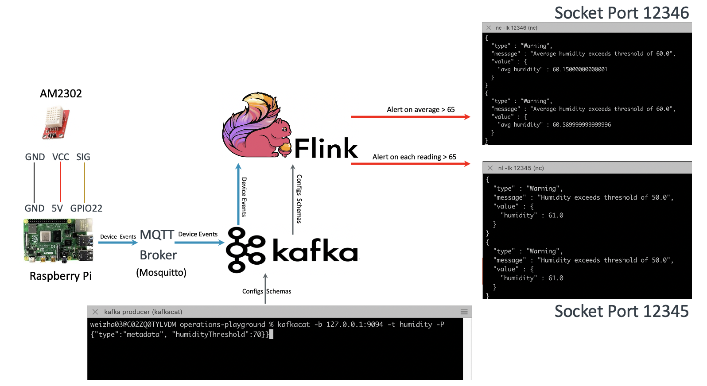

# DemoHumidityMonitoring

This is a demo that shows an event-driven processing pattern using open source projects. The high level architecture is shown as follows. 




# Quick Start
1. Start mosquitto server from local host (brew start mosquitto on MacOS):
   ```
   brew start mosquitto
   ```

2. Start services including flink job manager, flink taskmanager, kafka, zookeeper and kafka:
   ```
   cd flink-playgrounds
   docker-compose up
   ```

3. Start two terminal console, run a nc session from each of them with different ports:
   ```
   nc -lk 12345
   nc -lk 12346
   ```

4. Setup Pi and the AM2302 sensor, see the connection diagram in the humidity-collection-on-pi/setup.png
   ```
   cd humidity-collection-on-pi
   connect the sensor and the PI pins
   ```

5. Start mqtt client on raspberry to collect humidity readings from the sensor:
   ```
   scp humidity-collection.py root@[raspberry pi ip address]:~/
   ssh humidity-collection.py root@[raspberry pi ip address]
   python humidity-collection.py -h [ip address of your laptop] -p 1883
   ```

6. Start mqtt bridge to pass the readings to kafka:
   ```
   python humidity-from-mqtt-to-kafka.py -h localhost -p 1883
   ```
    
7. Build the flink applications;
   ```
      cd humidity-monitoring-flink-app
      mvn clean package
   ```

8. Submit apps from flink dashboard(localhost:8081);
   ```
   Start a browser and open localhost:8081;
   Submit New Job -> Add New -> Select HumidityMonitoringApp-1.0-SNAPSHOT.jar;
   Click the HumidityMonitoringApp-1.0-SNAPSHOT.jar under the Name column;
   Input isg.HumidityMonitoring in the Entry Class input box;
   ```

9.  Repeat the steps above to submit the isg.AvgHumidityMonitoring app;
    
10. Check warnings from the nc consoles;
    
11. Update the threshold from a new terminal console:
    ```
    kafkacat -b 127.0.0.1:9094 -t humidity -P
    {"type":"metadata", "humidityThreshold":70}}
    ```


# Folder Explained
- flink-playgrounds  - A clone from https://github.com/apache/flink-playgrounds.git with minor modification. It's to startup flink local services including jobmanager and taskmanager. It also start up a kafka and a zookeeper services;

- humidity-monitoring-flink-app - A very simple java project which contains two applications; One is the monitoring each of the humidity sensor readings and generate alerts to socket port 12345 when it's higher than a threshold; The other monitoring the average of humidity sensor readings in 30 seconds, when the average of the readings exceeds the threshold, then generate an alerts to socket port 12346;

- humidity-collection-on-pi  - There is a real sensor used in this demo. This folder contains a script to collect humidity readings from the sensor. The sensor readings are sent to a mosquitto server hosted on localhost, the topic is *humidity*;

- humidity-from-mqtt-to-kafka  - It contains a script to pass the humidity sensor readings from mqtt broker to local hosted kafka container; The kafka topic is also *humidity*; 


# Dependencies
## Hardware
- Raspberry Pi
- DHT22 Humidity&Temperature Sensor
- Laptop or Desktop with Docker installed;

## Middleware
- Mosquitto - An open source mqtt broker;
- Kafka - An open source message broker;
- Flink - An open source stream processing engine;

## Tools
- netcat
- pip
- Docker
- kafkacat (optional)
- Kafka Tool (optional)
- MQTT fx (optional)

## Programing Language
- Java 
- Python